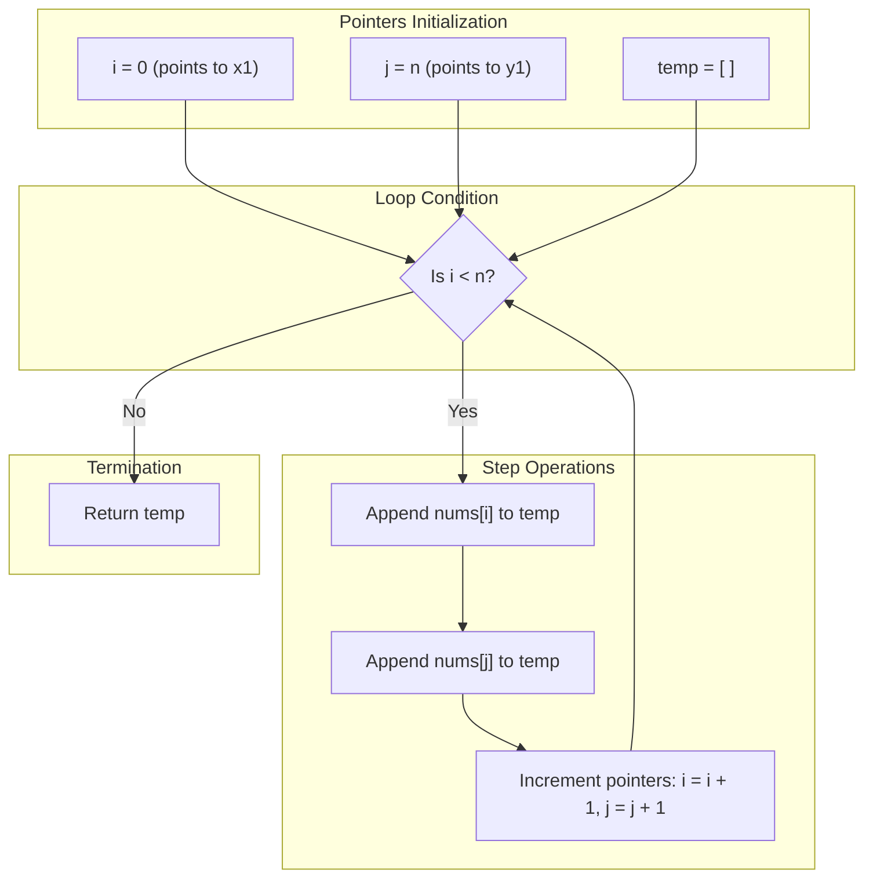

<h2><a href="https://leetcode.com/problems/shuffle-the-array">0000. Shuffle The Array</a></h2>

<p>Given the array <code>nums</code> consisting of <code>2n</code> elements in the form <code>[x<sub>1</sub>,x<sub>2</sub>,...,x<sub>n</sub>,y<sub>1</sub>,y<sub>2</sub>,...,y<sub>n</sub>]</code>.</p>

<p><em>Return the array in the form</em> <code>[x<sub>1</sub>,y<sub>1</sub>,x<sub>2</sub>,y<sub>2</sub>,...,x<sub>n</sub>,y<sub>n</sub>]</code>.</p>

<p>&nbsp;</p>
<p><strong class="example">Example 1:</strong></p>

<pre><strong>Input:</strong> nums = [2,5,1,3,4,7], n = 3
<strong>Output:</strong> [2,3,5,4,1,7] 
<strong>Explanation:</strong> Since x<sub>1</sub>=2, x<sub>2</sub>=5, x<sub>3</sub>=1, y<sub>1</sub>=3, y<sub>2</sub>=4, y<sub>3</sub>=7 then the answer is [2,3,5,4,1,7].
</pre>

<p><strong class="example">Example 2:</strong></p>

<pre><strong>Input:</strong> nums = [1,2,3,4,4,3,2,1], n = 4
<strong>Output:</strong> [1,4,2,3,3,2,4,1]
</pre>

<p><strong class="example">Example 3:</strong></p>

<pre><strong>Input:</strong> nums = [1,1,2,2], n = 2
<strong>Output:</strong> [1,2,1,2]
</pre>

<p>&nbsp;</p>
<p><strong>Constraints:</strong></p>

<ul>
	<li><code>1 &lt;= n &lt;= 500</code></li>
	<li><code>nums.length == 2n</code></li>
	<li><code>1 &lt;= nums[i] &lt;= 10^3</code></li>
</ul>

---

# 🛍️ Shuffle-The-Array | Explained

## Approach 1: Two-Pointer Interleaving with Auxiliary List
### Intuition
Think of this problem like performing a textbook "riffle shuffle" on a deck of cards. The deck has been cut cleanly into two equal halves of size $n$:
- **Half 1 (The $x$-group):** Located in the index range $[0, n - 1]$.
- **Half 2 (The $y$-group):** Located in the index range $[n, 2n - 1]$.

To produce the interleaved arrangement $[x_1, y_1, x_2, y_2, \dots, x_n, y_n]$, you place a finger at the start of the first half (pointer `i = 0`) and another finger at the start of the second half (pointer `j = n`). At each step, you take one card from beneath finger `i`, place it into a new pile, take one card from beneath finger `j`, place it into the pile right after, and advance both fingers by one step until all pairs are transferred.

### Algorithm Visualized


### Approach
1. **Initialize Two Pointers:** 
   - Set pointer `i = 0` to point to the start of the first half ($x_1$).
   - Set pointer `j = n` to point to the start of the second half ($y_1$).
2. **Allocate Result Container:** 
   - Create an empty dynamic array `temp` to store the interleaved elements.
3. **Iterate and Interleave:**
   - Loop as long as `i < n` (which runs exactly $n$ iterations).
   - In each iteration:
     - Append `nums[i]` (the current $x$-element).
     - Append `nums[j]` (the current $y$-element).
     - Increment `i` by 1 to move to the next $x$-element.
     - Increment `j` by 1 to move to the next $y$-element.
4. **Return Result:** 
   - Return `temp`, which now contains the fully shuffled $2n$ elements.

### Detailed Code Analysis
- **Lines 3–4 (`i = 0`, `j = n`):** 
  Establishes two read cursors. Because the array has an overall length of $2n$, elements from index `0` to `n - 1` correspond to $x_1 \dots x_n$, and elements from index `n` to `2n - 1` correspond to $y_1 \dots y_n$. Decoupling these into two separate pointers allows parallel traversal across both halves.
- **Line 5 (`temp = list()`):** 
  Initializes an empty Python list. In Python, `list()` instantiates a dynamic array that grows dynamically as elements are appended.
- **Line 6 (`while i < n:`):** 
  Sets the loop termination condition. Since each step consumes one element from the first half and one element from the second half, running until `i` reaches `n` ensures that both `i` and `j` traverse their respective ranges completely without out-of-bounds errors (`j` will naturally reach $2n$ when `i` reaches $n$).
- **Lines 7–8 (`temp.append(nums[i])`, `temp.append(nums[j])`):** 
  Appends the elements in alternating order to maintain the expected sequence $[x_k, y_k]$.
- **Lines 9–10 (`i = i + 1`, `j = j + 1`):** 
  Advances both pointers in lockstep by 1 index per iteration.
- **Line 11 (`return temp`):** 
  Returns the reconstructed list containing $2n$ elements.

### Code
```python
class Solution:
    def shuffle(self, nums: List[int], n: int) -> List[int]:
        i = 0
        j = n
        temp = list()
        while i < n:
            temp.append(nums[i])
            temp.append(nums[j])
            i = i + 1
            j = j + 1
        return temp
```

### Complexity
- **Time:** $O(n)$ — The loop executes exactly $n$ times. Within each iteration, array lookups and dynamic array appends (`list.append()`) operate in amortized $O(1)$ time. Thus, the total runtime is directly proportional to the number of elements in the input ($2n$), simplifying to $O(n)$.
- **Space:** $O(n)$ — An auxiliary list `temp` of size $2n$ is created to store and return the shuffled elements. Excluding the output array, the auxiliary space used by pointers `i` and `j` is $O(1)$.

---

## 🕵️‍♂️ Follow-up Questions (Optional)

1. **Can we solve this problem in $O(1)$ auxiliary space (in-place)?**
   - **Answer:** Yes, if the constraints allow integer packing. On LeetCode, $1 \le nums[i] \le 10^3$. A value of $1000$ requires at most $10$ bits ($2^{10} = 1024$). In a 32-bit integer, we can store two 10-bit numbers within a single array index using bit manipulation:
     - Encode: `nums[i] = nums[i] | (nums[i + n] << 10)` for each $i \in [0, n - 1]$.
     - Decode backwards: Place the second number (`nums[i] >> 10`) at index `2 * i + 1` and the first number (`nums[i] & 1023`) at index `2 * i`.
   - This achieves $O(n)$ time with strictly $O(1)$ extra space.

2. **Can this be implemented more idiomatically in Python?**
   - **Answer:** Yes. Python's `zip` function and list comprehensions make this concise:
     ```python
     class Solution:
         def shuffle(self, nums: List[int], n: int) -> List[int]:
             res = []
             for x, y in zip(nums[:n], nums[n:]):
                 res.extend([x, y])
             return res
     ```
     Or as a one-liner flattening the pairs:
     ```python
     return [val for pair in zip(nums[:n], nums[n:]) for val in pair]
     ```