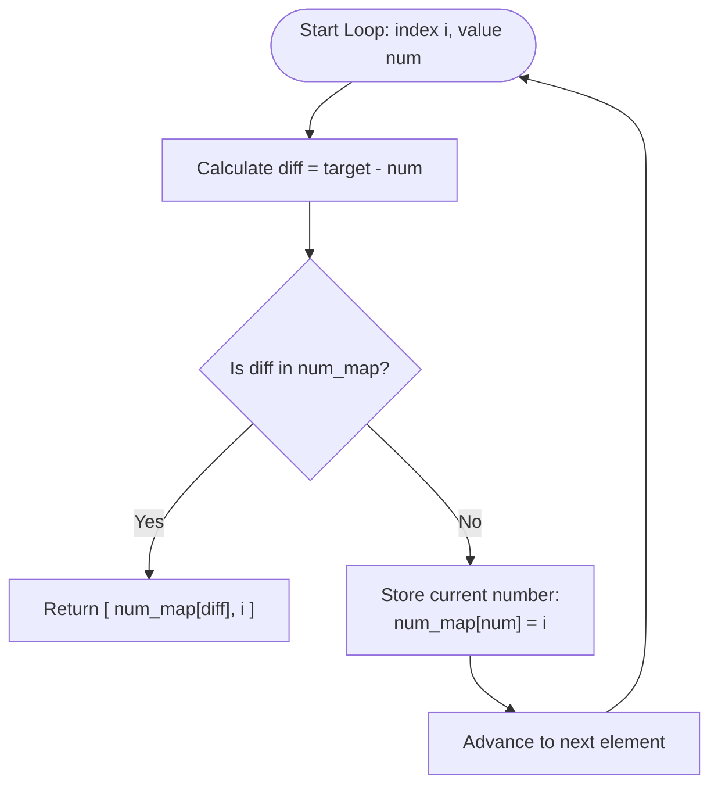

<h2><a href="https://leetcode.com/problems/two-sum">1. Two Sum</a></h2>

<p>You are given an array of integers <code>nums</code>&nbsp;and an integer <code>target</code>, return <em>indices of the two numbers such that they add up to <code>target</code></em>.</p>

<p>You may assume that each input would have <strong><em>exactly</em> one solution</strong>, and you may not use the <em>same</em> element twice.</p>

<p>You can return the answer in any order.</p>

<p>&nbsp;</p>
<p><strong class="example">Example 1:</strong></p>

<pre><strong>Input:</strong> nums = [2,7,11,15], target = 9
<strong>Output:</strong> [0,1]
<strong>Explanation:</strong> Because nums[0] + nums[1] == 9, we return [0, 1].
</pre>

<p><strong class="example">Example 2:</strong></p>

<pre><strong>Input:</strong> nums = [3,2,4], target = 6
<strong>Output:</strong> [1,2]
</pre>

<p><strong class="example">Example 3:</strong></p>

<pre><strong>Input:</strong> nums = [3,3], target = 6
<strong>Output:</strong> [0,1]
</pre>

<p>&nbsp;</p>
<p><strong>Constraints:</strong></p>

<ul>
	<li><code>2 &lt;= nums.length &lt;= 10<sup>4</sup></code></li>
	<li><code>-10<sup>9</sup> &lt;= nums[i] &lt;= 10<sup>9</sup></code></li>
	<li><code>-10<sup>9</sup> &lt;= target &lt;= 10<sup>9</sup></code></li>
	<li><strong>Only one valid answer exists.</strong></li>
</ul>

<p>&nbsp;</p>
<strong>Follow-up:&nbsp;</strong>Can you come up with an algorithm that is less than <code>O(n<sup>2</sup>)</code><font face="monospace">&nbsp;</font>time complexity?

---

# 🛍️ Two-Sum | Explained

## Approach 1: One-Pass Hash Table
### Intuition
Imagine you are walking into a room of people, each holding a numbered badge, looking for a pair whose numbers add up to a target value (e.g., `10`). 

Instead of standing at the entrance and asking every single person to compare their badge with everyone else in the room (a brute-force $O(N^2)$ approach), you hold a notepad. As you greet each person holding a badge value `num`, you immediately calculate what number they *need* to hit the target: `diff = target - num`. You check your notepad: "Have I already met someone holding `diff`?" 

- If **yes**, you instantly pair the current person with the person written in your notepad and finish.
- If **no**, you write down the current person's badge value and their position in your notepad (`num_map[num] = i`) and move to the next person.

Because checking your notepad (a Hash Table) takes constant time $O(1)$, you only need to walk through the line once.

### Algorithm Visualized


### Approach
1. **Initialize a Hash Map**: Create an empty dictionary (`num_map`) to store array values as keys and their corresponding indices as values.
2. **Iterate with Enumeration**: Loop through the `nums` list, keeping track of both the current index `i` and the value `num`.
3. **Calculate the Complement**: Compute `diff = target - num`. This `diff` represents the exact matching value needed to satisfy $num + diff = target$.
4. **Check for Complement**:
   - If `diff` exists in `num_map`, it means we have previously encountered the matching number. Return its stored index along with the current index `i`: `[num_map[diff], i]`.
5. **Record Current Element**: If the complement is not in `num_map`, record the current number and index (`num_map[num] = i`) so future elements can look it up.

### Detailed Code Analysis

Let's break down the execution line-by-line:

- **Line 3 (`num_map=dict()`):**
  Instantiates an empty Python dictionary (`dict`). Under the hood, Python dictionaries are implemented as dynamic hash tables using open addressing. Key lookup, insertion, and membership testing (`in`) operate in $O(1)$ average time complexity.

- **Line 4 (`for i ,num in enumerate(nums):`):**
  Uses Python's built-in `enumerate()` function. This avoids manually managing an index counter variable and yields a tuple `(index, element)` on each iteration, keeping the loop clean and Pythonic.

- **Line 5 (`diff=target-num`):**
  Calculates the required addend (complement). Mathematically, if $a + b = \text{target}$, then $b = \text{target} - a$. Storing this in `diff` avoids repeating the arithmetic operation.

- **Line 6 (`if diff in num_map:`):**
  Performs a hash table key lookup. Because Python dictionary keys are hashed, this check takes $O(1)$ average time rather than performing an $O(N)$ linear search across the previously seen elements.

- **Line 7 (`return [num_map[diff],i]`):**
  If the complement is found, the function immediately terminates and returns a list containing two indices: `num_map[diff]` (the index of the previously seen complement) and `i` (the index of the current element). Returning early guarantees minimum runtime as soon as a valid pair is discovered.

- **Line 8 (`num_map[num]=i`):**
  If `diff` was not found, the current number `num` is added to `num_map` with index `i` as its value. Crucially, this insertion happens **after** checking for `diff`. This ordering prevents an element from matching with itself (e.g., if `target = 6` and `num = 3`, it will not return `[i, i]`).

### Code
```python
class Solution:
    def twoSum(self, nums: List[int], target: int) -> List[int]:
        num_map=dict()
        for i ,num in enumerate(nums):
            diff=target-num
            if diff in num_map:
                return [num_map[diff],i]
            num_map[num]=i
```

### Complexity
- **Time Complexity:** $\mathcal{O}(N)$
  We traverse the list containing $N$ elements at most once. Each lookup and insertion into the dictionary takes $\mathcal{O}(1)$ average time. Thus, the overall time complexity is linear, $\mathcal{O}(N)$.

- **Space Complexity:** $\mathcal{O}(N)$
  In the worst-case scenario (e.g., the matching pair is at the very end of the array), we will store $N - 1$ elements in `num_map`. Therefore, the extra space required scales linearly with the size of the input array, $\mathcal{O}(N)$.

---

## 🕵️‍♂️ Follow-up Questions (Optional)

### 1. What if the input array is already sorted?
If the input array `nums` is already sorted in ascending order, you can solve this problem in $\mathcal{O}(N)$ time and $\mathcal{O}(1)$ auxiliary space using the **Two-Pointer Technique**:
- Place one pointer `left` at the beginning (`0`) and `right` at the end (`len(nums) - 1`).
- Compute `current_sum = nums[left] + nums[right]`.
- If `current_sum == target`, return `[left, right]`.
- If `current_sum < target`, increment `left` to increase the sum.
- If `current_sum > target`, decrement `right` to decrease the sum.

### 2. How does this solution handle duplicate numbers in `nums`?
The code naturally handles duplicate numbers without any special logic. Because the lookup check (`if diff in num_map:`) occurs **before** the current element is inserted into `num_map`:
- If `target = 6` and `nums = [3, 3]`:
  1. Index `0` (value `3`): `diff = 3`. Not in `num_map`. Insert `num_map[3] = 0`.
  2. Index `1` (value `3`): `diff = 3`. Found in `num_map` at index `0`. Returns `[0, 1]`.
- If duplicates are not part of the solution pair, the dictionary key `num_map[num] = i` simply updates to the most recent index, which does not affect correctness for subsequent complements.