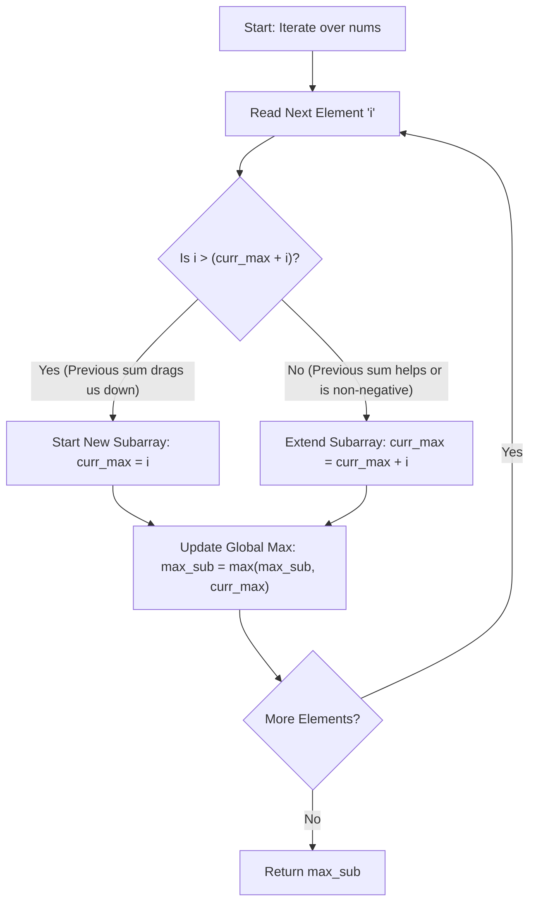

<h2><a href="https://leetcode.com/problems/maximum-subarray">53. Maximum Subarray</a></h2>

<p>Given an integer array <code>nums</code>, find the <span data-keyword="subarray-nonempty" class=" cursor-pointer relative text-dark-blue-s text-sm"><button type="button" aria-haspopup="dialog" aria-expanded="false" aria-controls="radix-_r_s_" data-state="closed" class="">subarray</button></span> with the largest sum, and return <em>its sum</em>.</p>

<p>&nbsp;</p>
<p><strong class="example">Example 1:</strong></p>

<pre><strong>Input:</strong> nums = [-2,1,-3,4,-1,2,1,-5,4]
<strong>Output:</strong> 6
<strong>Explanation:</strong> The subarray [4,-1,2,1] has the largest sum 6.
</pre>

<p><strong class="example">Example 2:</strong></p>

<pre><strong>Input:</strong> nums = [1]
<strong>Output:</strong> 1
<strong>Explanation:</strong> The subarray [1] has the largest sum 1.
</pre>

<p><strong class="example">Example 3:</strong></p>

<pre><strong>Input:</strong> nums = [5,4,-1,7,8]
<strong>Output:</strong> 23
<strong>Explanation:</strong> The subarray [5,4,-1,7,8] has the largest sum 23.
</pre>

<p>&nbsp;</p>
<p><strong>Constraints:</strong></p>

<ul>
	<li><code>1 &lt;= nums.length &lt;= 10<sup>5</sup></code></li>
	<li><code>-10<sup>4</sup> &lt;= nums[i] &lt;= 10<sup>4</sup></code></li>
</ul>

<p>&nbsp;</p>
<p><strong>Follow up:</strong> If you have figured out the <code>O(n)</code> solution, try coding another solution using the <strong>divide and conquer</strong> approach, which is more subtle.</p>


---

# 🛍️ Maximum-Subarray | Explained

## Approach 1: Kadane's Algorithm (Dynamic Programming / Greedy)

### Intuition
Imagine running a business month by month and tracking your cumulative profit. If your accumulated balance drops so low that you are in a massive deficit, keeping that historical debt attached to next month's profit will only drag future results down. At that point, it is financially wiser to declare bankruptcy, cut your losses, and start fresh from the current month's revenue.

This is the core intuition behind **Kadane's Algorithm**. At any position in the array, we ask a fundamental question: *Is it better to extend the existing contiguous subarray sum, or discard the past sum and start a brand-new contiguous subarray from the current element?* 

If adding the current number `i` to our running sum (`curr_max + i`) produces a smaller value than `i` itself, it means the running sum was negative and acts as a drag. Thus, we greedily discard the previous prefix and set our running total to start fresh at `i`.

### Algorithm Visualized



### Approach
1. **Initialize Sentinel Variables:**
   - Set `max_sub` to negative infinity (`float('-inf')`). This ensures that even if all numbers in the input array are negative, the algorithm correctly identifies the maximum single negative value.
   - Set `curr_max` to `0` as the initial local subarray accumulator.
2. **Iterate Through the Input Array:**
   - Loop through each element `i` in `nums`.
3. **Local Optimal Choice (State Transition):**
   - Calculate the local maximum subarray sum ending at the current index using `curr_max = max(i, curr_max + i)`.
4. **Global Optimal Update:**
   - Compare `curr_max` with `max_sub` and store the higher value back in `max_sub`.
5. **Return Result:**
   - After the loop finishes processing all elements, return `max_sub`.

### Detailed Code Analysis

```python
class Solution:
    def maxSubArray(self, nums: List[int]) -> int:
        max_sub=float('-inf')
        curr_max=0
        for i in nums:
            curr_max=max(i,curr_max+i)
            max_sub=max(max_sub,curr_max)
        return max_sub
```

- **Line 3 (`max_sub=float('-inf')`)**: Standard global accumulator initialization. Using negative infinity prevents bug edge-cases where an array contains exclusively negative numbers (e.g., `[-5, -2, -3]`), ensuring `max_sub` correctly gets overwritten by `-2` instead of incorrectly returning `0`.
- **Line 4 (`curr_max=0`)**: Initializes the local accumulator variable that will track the maximum contiguous sum ending at the current position.
- **Line 5 (`for i in nums:`)**: Standard Python $O(N)$ traversal over each element in the input list sequentially.
- **Line 6 (`curr_max=max(i,curr_max+i)`)**: This line is the core implementation of Kadane's Algorithm (a 1D Dynamic Programming state transition: $dp[i] = \max(nums[i], dp[i-1] + nums[i])$). 
  - If `curr_max` before this line was negative (e.g., `-3`), adding `i` (e.g., `2`) yields `-1`.
  - Comparing `max(2, -1)` selects `2`, effectively resetting the contiguous subarray window to begin at index $i$.
- **Line 7 (`max_sub=max(max_sub,curr_max)`)**: Updates the global tracking variable `max_sub`. Because `curr_max` represents the peak subarray sum ending strictly at index $i$, `max_sub` captures the maximum `curr_max` value recorded across the entire array traversal.
- **Line 8 (`return max_sub`)**: Returns the single integer representing the maximum contiguous subarray sum found.

### Code
```python
class Solution:
    def maxSubArray(self, nums: List[int]) -> int:
        max_sub = float('-inf')
        curr_max = 0
        for i in nums:
            curr_max = max(i, curr_max + i)
            max_sub = max(max_sub, curr_max)
        return max_sub
```

### Complexity
- **Time Complexity:** $\mathcal{O}(N)$ — We iterate through the array of $N$ elements exactly once. Inside the loop, basic arithmetic and `max()` operations take constant $\mathcal{O}(1)$ time.
- **Space Complexity:** $\mathcal{O}(1)$ — Only two scalar variables (`max_sub` and `curr_max`) are maintained in memory throughout execution, achieving optimal constant space utilization.

---

## 🕵️‍♂️ Follow-up Questions

### 1. How would you modify this solution to return the starting and ending indices of the maximum subarray instead of just the sum?
**Answer:** Maintain three pointer variables: `start = 0`, `end = 0`, and a temporary start tracker `temp_start = 0`.
- Whenever `curr_max` resets (i.e., `i > curr_max + i`), set `temp_start = current_index`.
- Whenever `curr_max > max_sub`, update `max_sub = curr_max`, set `start = temp_start`, and `end = current_index`.
- At the end, the slice `nums[start : end + 1]` yields the actual elements.

### 2. Can this problem be solved using a Divide and Conquer strategy, and what would its complexity be?
**Answer:** Yes. Split the array into equal left and right halves around a midpoint `mid`. The maximum subarray sum must lie in one of three places:
1. Entirely in the left half: $\text{Solve}(left, mid)$
2. Entirely in the right half: $\text{Solve}(mid + 1, right)$
3. Crossing the midpoint: Maximum sum extending left from `mid` + Maximum sum extending right from `mid + 1`.

Combining these options recursively gives a Time Complexity of $\mathcal{O}(N \log N)$ and a Space Complexity of $\mathcal{O}(\log N)$ due to the call stack. While less efficient than Kadane's $\mathcal{O}(N)$ approach, it is useful for understanding tree-based partitioning schemes.