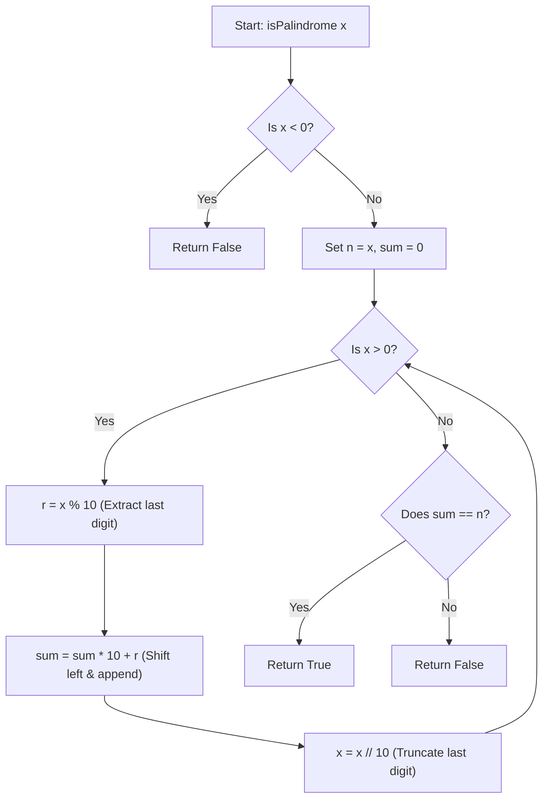

<h2><a href="https://leetcode.com/problems/palindrome-number">9. Palindrome Number</a></h2>

<p>Given an integer <code>x</code>, return <code>true</code> if <code>x</code> is a <span data-keyword="palindrome-integer" class=" cursor-pointer relative text-dark-blue-s text-sm"><button type="button" aria-haspopup="dialog" aria-expanded="false" aria-controls="radix-_r_17_" data-state="closed" class=""><strong>palindrome</strong></button></span>, and <code>false</code> otherwise.</p>

<p>&nbsp;</p>
<p><strong class="example">Example 1:</strong></p>

<pre><strong>Input:</strong> x = 121
<strong>Output:</strong> true
<strong>Explanation:</strong> 121 reads as 121 from left to right and from right to left.
</pre>

<p><strong class="example">Example 2:</strong></p>

<pre><strong>Input:</strong> x = -121
<strong>Output:</strong> false
<strong>Explanation:</strong> From left to right, it reads -121. From right to left, it becomes 121-. Therefore it is not a palindrome.
</pre>

<p><strong class="example">Example 3:</strong></p>

<pre><strong>Input:</strong> x = 10
<strong>Output:</strong> false
<strong>Explanation:</strong> Reads 01 from right to left. Therefore it is not a palindrome.
</pre>

<p>&nbsp;</p>
<p><strong>Constraints:</strong></p>

<ul>
	<li><code>-2<sup>31</sup>&nbsp;&lt;= x &lt;= 2<sup>31</sup>&nbsp;- 1</code></li>
</ul>

<p>&nbsp;</p>
<strong>Follow up:</strong> Could you solve it without converting the integer to a string?

---

# 🛍️ Palindrome-Number | Explained

## Approach 1: Full Integer Reversal via Arithmetic
### Intuition
Think of a palindrome as a sequence of symmetry, like a stack of numbered physical blocks. If you take blocks off the top of the original stack one by one and place them onto a new stack, a palindromic sequence will look identical to the original sequence when you are finished.

Mathematically, any negative number (e.g., `-121`) cannot be a palindrome because reversing it leaves the negative sign at the trailing end (`121-`), which is not a valid representation. For positive numbers, we can reconstruct the reversed integer digit-by-digit using base-10 arithmetic operations (modulo `%` to pick off the last digit, and integer division `//` to remove it) and check if the final reconstructed number matches the original input.

### Algorithm Visualized


### Approach
1. **Handle Edge Case (Negative Numbers):** If $x < 0$, instantly return `False` as negative signs prevent mathematical palindromes.
2. **Preserve Original Value:** Save the value of `x` into an auxiliary variable `n` because `x` will be destructively modified in the loop down to `0`.
3. **Initialize Accumulator:** Maintain an integer `sum = 0` to build the reversed number.
4. **Digit Extraction Loop:** While `x > 0`:
   - Extract the rightmost digit using `r = x % 10`.
   - Append `r` to `sum` by shifting existing digits left: `sum = sum * 10 + r`.
   - Remove the rightmost digit from `x` using integer division: `x = x // 10`.
5. **Final Comparison:** Compare the fully reversed integer `sum` with the original value stored in `n`. Return `True` if equal, `False` otherwise.

### Detailed Code Analysis

* **Line 4-5:** `if x < 0: return False`
  Directly eliminates all negative values in $O(1)$ time.

* **Line 7:** `n = x`
  Stores a copy of the input integer `x`. Since the `while` loop mutates `x` by repeatedly dividing it by 10 until it reaches `0`, keeping `n` allows us to compare the reversed result back to the original input.

* **Line 8:** `sum = 0`
  Serves as the accumulator for the reversed value. 
  *(Engineers' Note: While functional, using `sum` shadows Python's built-in `sum()` function. In production, a variable name like `reversed_num` is preferred).*

* **Line 9:** `while x > 0:`
  Executes the loop once for every digit present in $x$.

* **Line 10:** `r = x % 10`
  Uses the modulo operator to extract the least significant digit (LSD). For example, if $x = 123$, $123 \pmod{10} = 3$.

* **Line 11:** `sum = sum * 10 + r`
  Shifts the existing digits in `sum` one place to the left (base 10) and adds the extracted digit `r` to the ones place.
  - Iteration 1 ($x=123$): `sum = 0 * 10 + 3 = 3`
  - Iteration 2 ($x=12$):  `sum = 3 * 10 + 2 = 32`
  - Iteration 3 ($x=1$):   `sum = 32 * 10 + 1 = 321`

* **Line 12:** `x = x // 10`
  Applies integer floor division to drop the rightmost digit that was just processed.

* **Line 13:** `return sum == n`
  Performs a boolean evaluation comparing the reconstructed `sum` with the saved original value `n`.

### Code
```python
class Solution:
    def isPalindrome(self, x: int) -> bool:
        if x < 0:
            return False
        else:
            n = x
            sum = 0
            while x > 0:
                r = x % 10
                sum = sum * 10 + r
                x = x // 10
            return sum == n
```

### Complexity
- **Time Complexity:** $\mathcal{O}(\log_{10}(x))$ — The number of loop iterations is directly proportional to the number of digits in $x$, which is $\lfloor\log_{10}(x)\rfloor + 1$.
- **Space Complexity:** $\mathcal{O}(1)$ — Uses a constant amount of extra memory ($n$, $sum$, $r$) regardless of the magnitude of the input integer.

---

## 🕵️‍♂️ Follow-up Questions

### 1. How can we optimize this approach to avoid potential integer overflow and reduce runtime by half?
**Answer:** Instead of reversing the entire integer, we can reverse only the **latter half** of the number and compare it directly to the **former half**. 
- In statically typed languages (e.g., C++, Java), reversing a full 32-bit integer like `2,147,483,647` can cause integer overflow.
- We can stop the processing loop as soon as `reversed_num >= x`.
- For odd-length numbers, we can strip the middle digit using `reversed_num // 10` before comparing (e.g., for `12321`, `x` becomes `12` and `reversed_num` becomes `123`; dropping the last digit yields `12 == 12`).

### 2. Are there any edge cases besides negative numbers that can be eliminated immediately in $O(1)$ time?
**Answer:** Yes. Any non-zero number that ends in `0` (e.g., `10`, `100`, `1230`) cannot be a palindrome because an integer cannot start with a leading zero. We can add a quick check:
```python
if x < 0 or (x % 10 == 0 and x != 0):
    return False
```